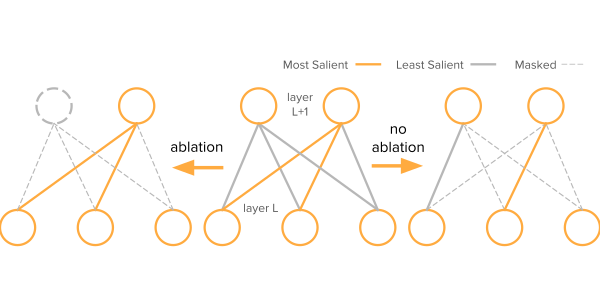

# condensed-sparsity


## Getting Started
This repository contains the source code for the Structured RigL (`SRigL`) a dynamic sparse training (DST) algorithm based on [RigL](https://arxiv.org/abs/1911.11134). `SRigL` learns a sparse neural network with a hybrid fine-grained and structured (neuron) sparse topology. The fine-grained structure is obtained by enforcing a constant fan-in constraint for each layer in the neural network and is a particular case of N:M sparsity. The representation learned by `SRigL` is not only memory and parameter efficient, it also is amenable to acceleration on commodity hardware. 

 

`SRigL` maintains generalization performance comparable with RigL and other unstructured sparse DST algorithms up to a high sparsity level. A key innovation required to match unstructured sparse performance is to enable *neuron ablation*; i.e., we fully mask select neurons based on the aggregated salience of its constituent weights. 

 

We currently support the following dataset/model pairs:
* CIFAR-10:
  * Wide ResNet-22
  * ResNet-18, modified for CIFAR-10
* ImageNet
  * ResNet-50
  * MobileNet, Large and Small
  * ViT-B-16

## Repository Structure
* `./train_rigl.py` is the main training script. We currently support trainin Wide ResNet-22 and
* `./src/rigl_torch` contains the source code for SRigL. 
  * `./src/rigl_torch/rigl_scheduler.py` contains source code for `RigLScheduler`, an implementation of `RigL` in pytorch.
  * `./src/rigl_torch/rigl_constant_fan.py` contains the source code for `RigLConstFanScheduler` aka: `SRigL`.
* `./src/condensed_sparsity/condensed_linear.py` contains the source code for our naive pytorch GEMM implementation that leverages the constant fan-in structure learned by SRigL. 
* `./configs/config.yaml` contains the settings for the various hyperparameters and runtime options. 

## Example Commands
* ResNet50 trained on Imagenet using 4-GPUs on a single node:

```bash
python ./train_rigl.py \
    dataset=imagenet \
    model=resnet50
```

* Resnet18 trained on CIFAR-10:
```bash
python ./train_rigl.py \
  dataset=cifar10 \
  model=resnet18
```

* ViT/B-16 trained on CIFAR-10:
```bash
python ./train_rigl.py \
  dataset=imagenet \
  model=vit
```

## Installation
This project was developed using Python version >=3.10 and uses `poetry==1.6.1` to manage dependencies and build the project. 

Installation instructions are provided for virtual enviornments, Compute Canada clusters, and Docker: 

## Virtual Env
        python -m venv .venv
        source .venv/bin/activate
        pip install --upgrade pip
        pip install poetry==1.6.1
        poetry install -vvv  # With install all dependency groups
        git submodule update # Pull in cocoapi for detection / segmentation
        cd ./src/cocoapi/PythonAPI
        make & make install
        cd ../../..  # back to workspace dir
        pre-commit install-hooks  # For development

## Docker
For reproduction and instantiating replica's during training / inference, please use `Dockerfile` to build the image. Alternatively, you can pull the image from [Docker Hub](https://hub.docker.com/repository/docker/mklasby/condensed-sparsity). A large shm-size is required for pytorch to train ImageNet as this directory is used by the dataloader workers

### Replica / Reproduction Container

    docker build --file ./Dockerfile -t rigl-agent --shm-size=16gb .
    docker run -itd --env-file ./.env --mount source=/datasets/ILSVRC2012,target=/datasets/ILSVRC2012,type=bind --gpus all --shm-size 16G rigl-agent:latest


### Development Container
For development, we recommend using vscode's devcontainer functionality to build and launch the development container. A `devcontainer.json` schema is provided in `./.devcontainer/` and if the project working directory is opened in vscode, the application will prompt the user to reopen in the development container. Please refer to the `devcontainer.json` schema and `Dockerfile.dev` for specifics on the development container environment and build process. 

To get started, please complete the following steps before reopening the workspace in the devcontainer:
* Copy the `.env.template` file to your own `.env` environiment file and edit it to add environmental variables. Without the `.env` file the dev container will not start.
* Create a directory `/datasets` and place any datasets you want to use (except for CIFAR-10) in that location. Alternatively, edit the mount directories in `./.devcontainer/devcontainer.json`
* Run `git submodue update` to pull from `cocoapi` third party repo. Migrate to ./src/cocoapi/PythonAPI and run `make && make install`

## Pretrained Model Checkpoints:
A variety of model's pretrained with SRigL are available on [huggingface](https://huggingface.co/mklasby/srigl).

## Compute Canada
Compute Canada pre-builds many python packages into wheels that are stored in a local wheelhouse. It is best practice to use these wheels rather than use package distributions from PyPI. Therefore, the dependencies pinned in `pyproject.toml` have been carefully selected to ensure that the project enviornment can be replicated using the Compute Canada wheels that will match a local enviornment using PyPI package distributions. 

For simplicity, a bash script for installing the project and dependencies is included, see: `./scripts/build_cc_venv.sh`. Simply run this script from the project working directory after cloning the project from github. 

## Tests
This repository uses `pytest`.

Run tests using `pytest`
